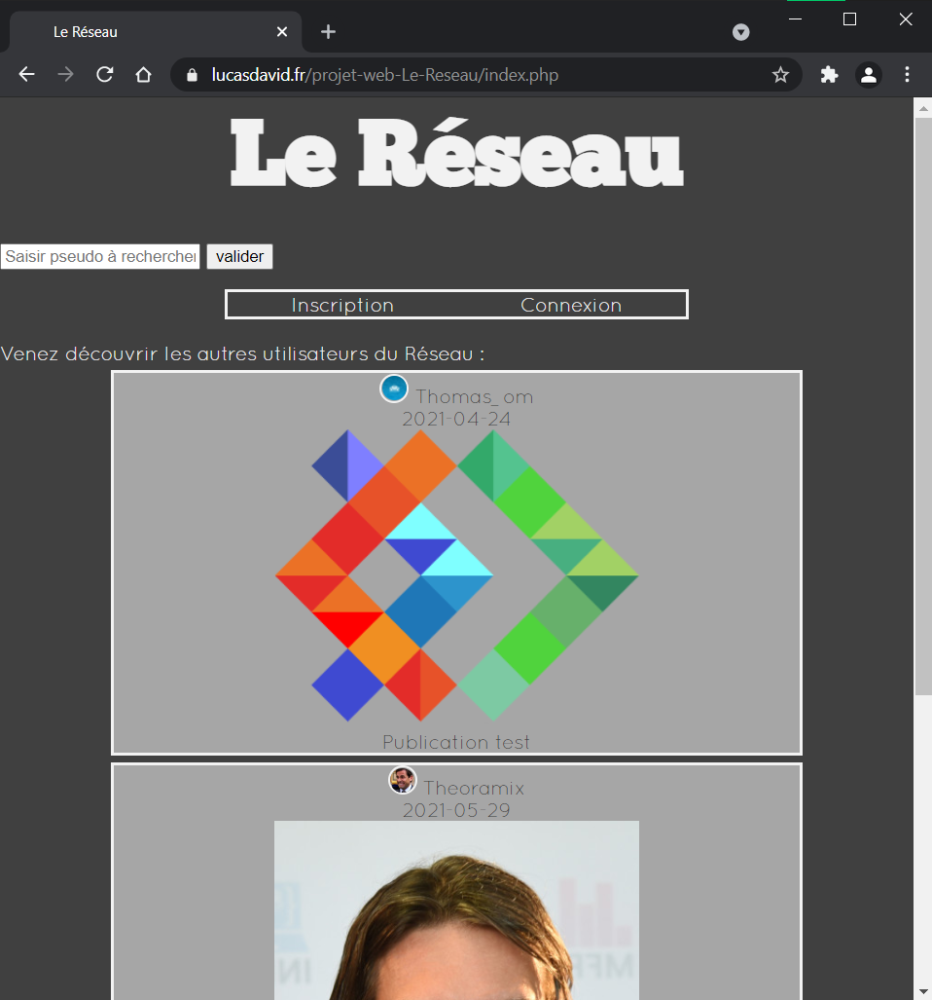
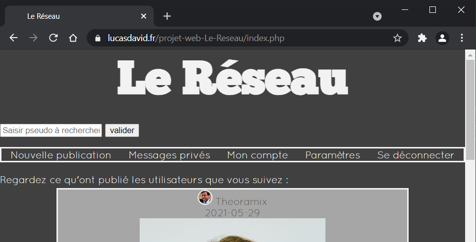
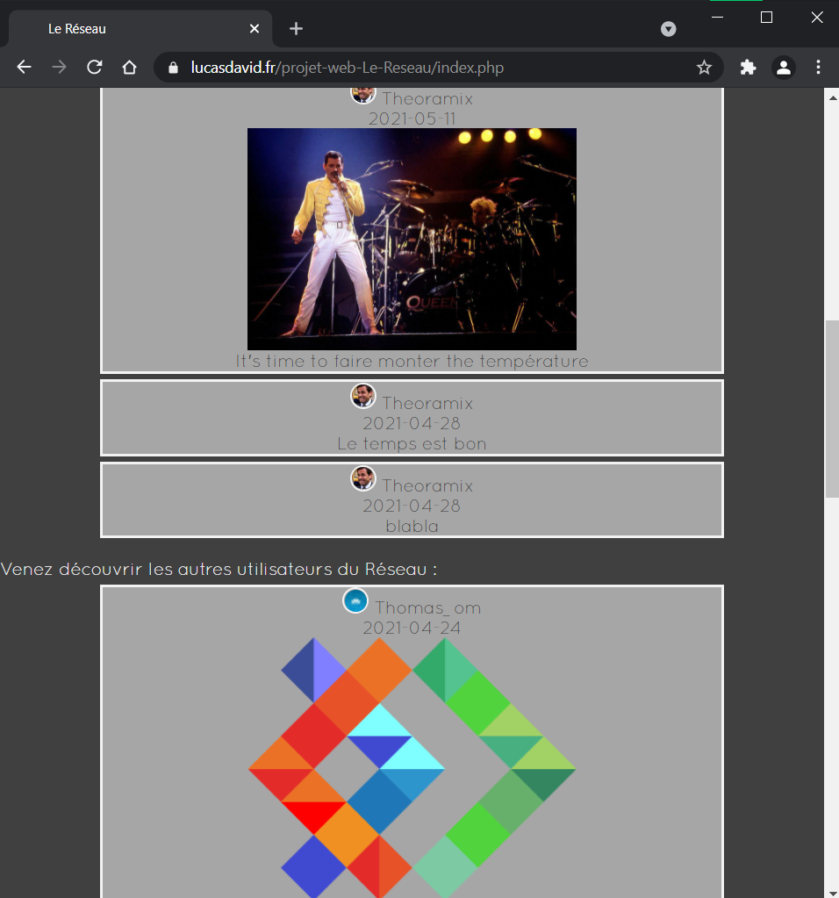
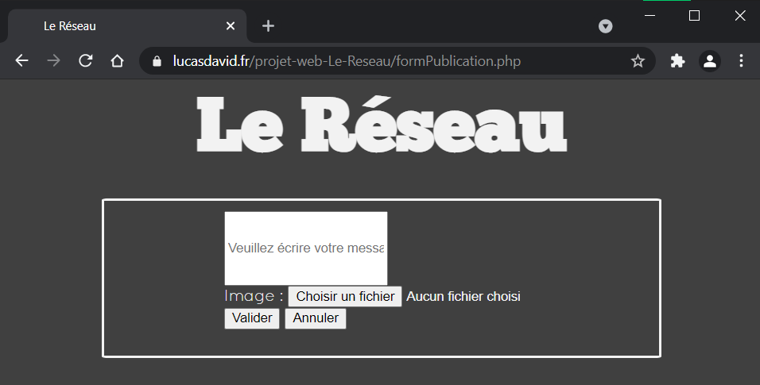
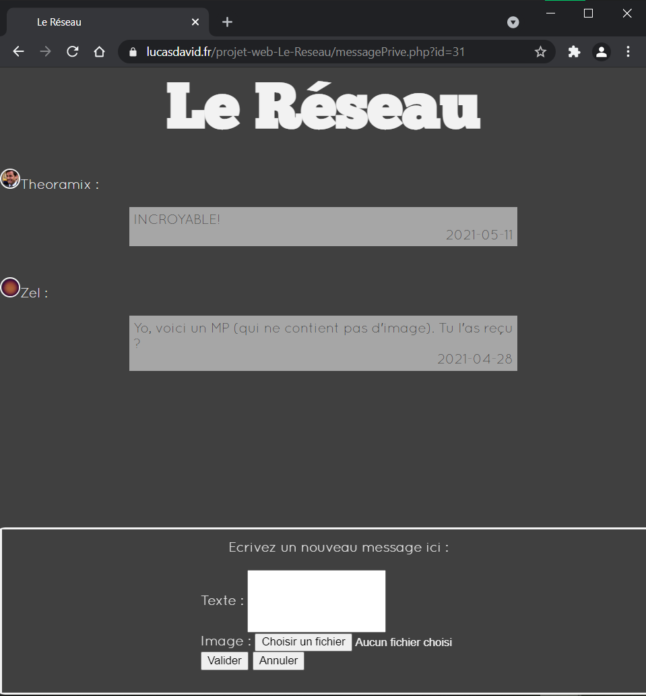
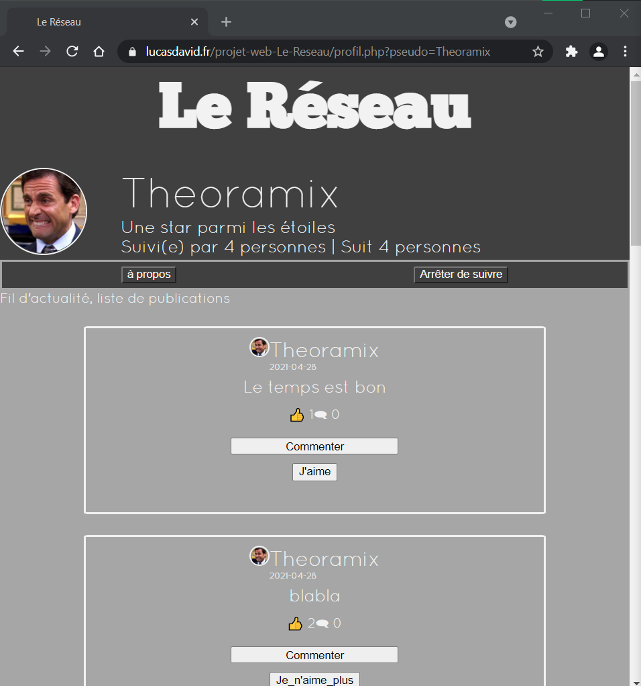
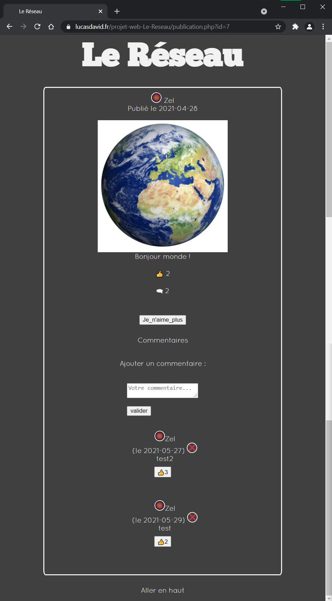
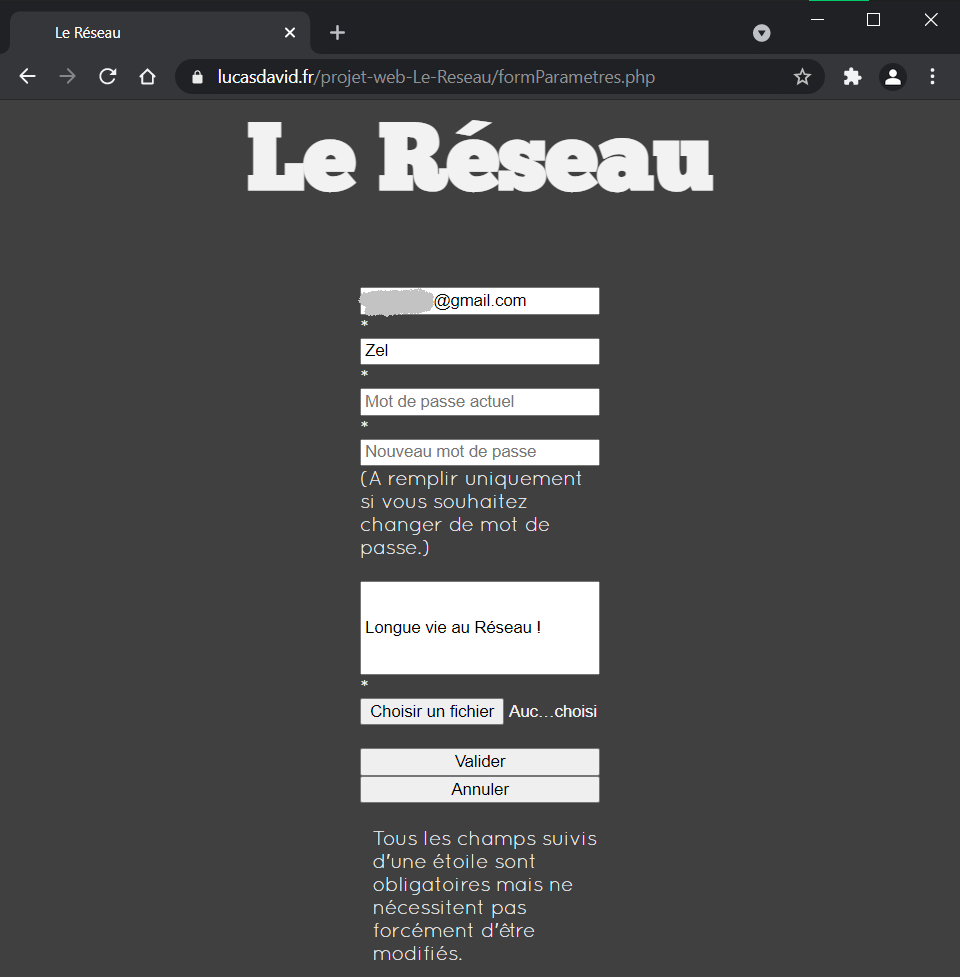

# Le Réseau

## Context
Project made during the 2nd semester at IMAC engineering school, for the backend programming course.

## Description
_Le Réseau_ is a mini social network project, allowing content to be shared between friends and/or strangers.
An account system makes it possible to publish text or images, but also to “follow” other users, whose publications are highlighted on a home page.
Users following each other (“friends”) are able to communicate through private messages.
In addition, an administrator space allows interactions between users to be moderated (deletion of content, _etc._).

## Screenshots

## Hosted website
https://lucasdavid.fr/projet-web-Le-Reseau/
